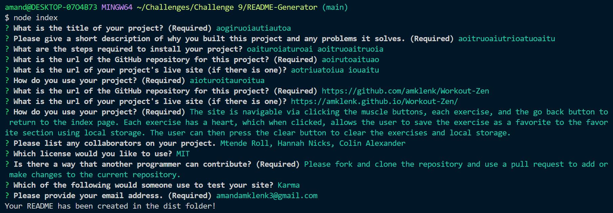
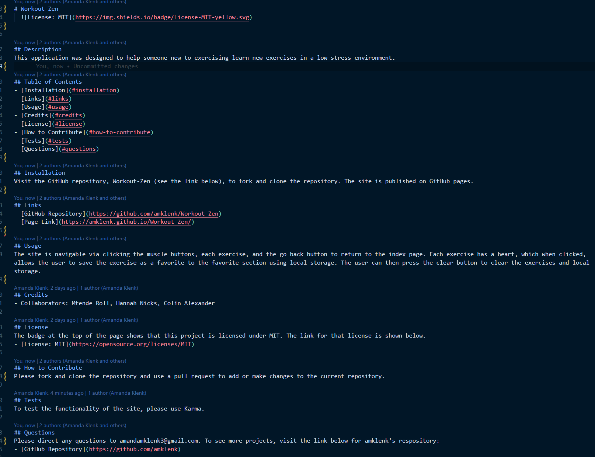
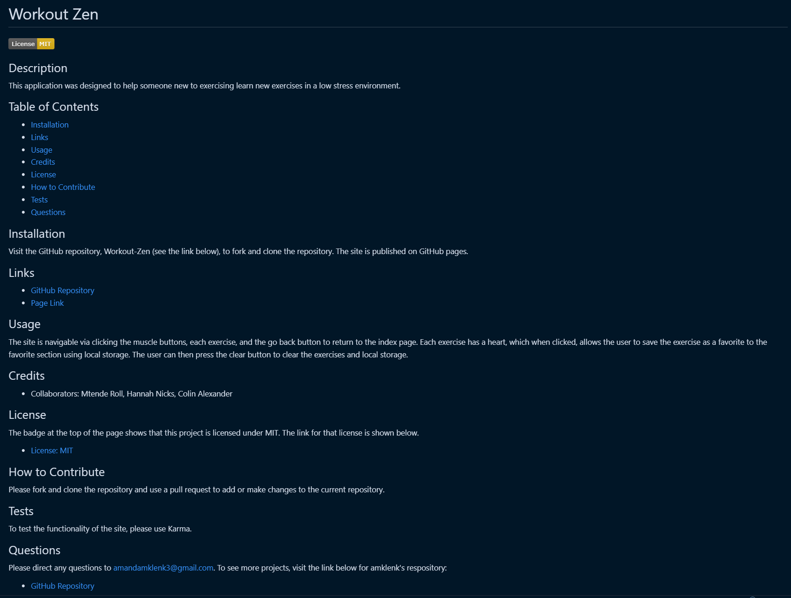

# README-Generator


## Description

This project was created for a developer to quickly generate a high-quality, professional README. The user will fill out their information in a command-line application that is then inserted into a template to generate their README.

The following were the requirements of the project:
* When the user enters the project title, description, installation instructions, usage information, contribution guidelines, and test instructions, this information will be displayed in the corresponding sections of the README.
* When the user chooses a license, the badge is shown at the top of the page and a link for the license and a quick explanation will be displayed in the corresponding section of the README.
* When the user enters their GitHub username, it is shown in the Questions section along with a link to their repository on GitHub.
* When the user enters their email address, this is shown in the Questions section as a mode for communication and further questions.
* When the user clicks on the links in the Table of Contents, each link takes them to the corresponding section of the README.

## Table of Contents
- [Installation](#installation)
- [Links](#links)
- [Usage](#usage)
- [Credits](#credits)
- [License](#license)
- [How to Contribute](#how-to-contribute)
- [Questions](#questions)

## Installation
Visit the GitHub repository, README-Generator (see the link below), to fork and clone the repository. The JSON file will have the necessary dependencies. Use:
````````````
npm install
````````````
The .gitignore file is set up in the root directory along with the index.js file that contains most of the command line code. The utils folder contains the generateMarkdown file, which contains the template for the README file and the module_export to index.js. The dist folder will contain the generated README.

## Links
- [GitHub Repository](https://github.com/amklenk/README-Generator)

## Usage
The following images are project screenshots.

CLI App


Example of a Generated Markdown File


Example of a Preview of a Generated Markdown File


The application is navigable via opening the index.js file in an integrated terminal. All of the user data is entered using Inquirer prompts. The user will receive a message to let them know that the README file is ready. The generated file will appear in the dist folder.

## Credits
The license badges and links were obtained from the following repository:
- [GitHub Gist Repository for lukas-h](https://gist.github.com/lukas-h/2a5d00690736b4c3a7ba)

## License
The badge at the top of the page shows that this project is licensed under MIT. The link for that license is shown below.
- [License: MIT](https://opensource.org/licenses/MIT)
## How to Contribute
Please fork and clone the repository and use a pull request to add or make changes to the current repository.

## Questions
Please direct any questions to amandamklenk3@gmail.com. To see more projects, visit the link below for amklenk's respository: 
- [GitHub Repository](https://github.com/amklenk)